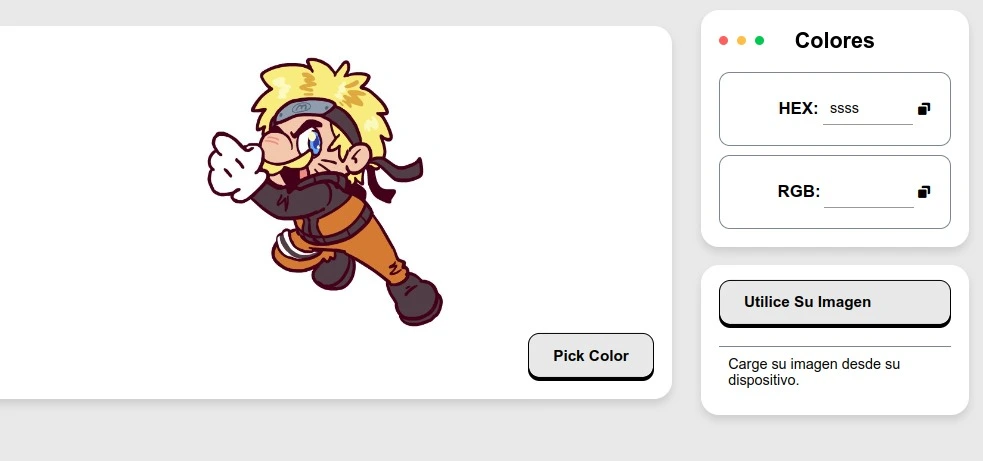

# Google Clone

    

 

## Decripcion

Esta aplicacion ayuda a encontrar colores exactos de una imagen.

## Funciones o datos del proyecto

- Obtiene colores de una imagen y los muestra, tambien se pueden copiar.
- Se puede utilizar una imagen de un dispositivo propio.

## Link

- https://teal-genie-3c079b.netlify.app/

## Lenguajes o Herramientas

- HTML
- CSS
- JS

## Autor

** Diego Nieves **

- [LinkedIn](https://www.linkedin.com/in/diego-nieves-04b409242/)
- [Portafolio web](https://nvs-dlc.netlify.app)

## Contratación

Si quieres contratarme puedes escribirme a nieves.diego0426@gmail.com 👍.

  

    

